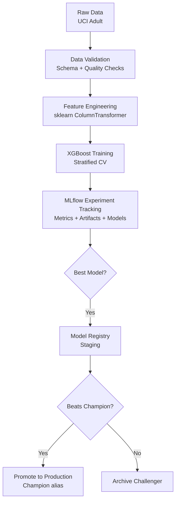
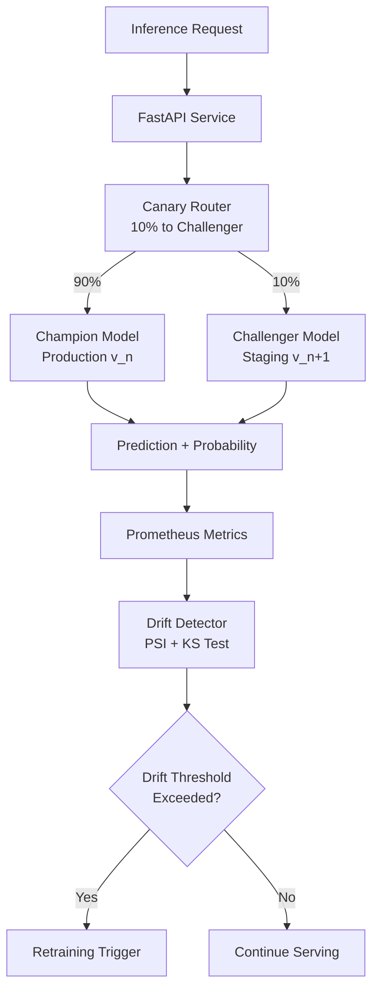

# Production ML Lifecycle Platform


End-to-end ML platform covering the full model lifecycle: data validation, experiment tracking, model registry, canary deployment, drift detection, and automated retraining. The ML task is simple by design — **0.927 AUC-ROC** on Adult Income with XGBoost. The platform around it is not, and that platform is what most ML portfolios omit.

---

## Architecture

### Training & Registry Pipeline



### Serving & Monitoring Pipeline



---

## Model Performance

XGBoost on UCI Adult Income (48K samples, stratified 70/10/20 split):

| Metric | Value |
|---|---|
| AUC-ROC | 0.927 |
| Average Precision | 0.876 |
| F1 | 0.744 |
| Precision | 0.779 |
| Recall | 0.711 |

All metrics logged to MLflow. Feature importances and confusion matrix saved as run artifacts.

---

## Key Design Decisions

**MLflow as deployment control plane:** Self-hostable, no SaaS dependency. `champion`/`challenger` aliases make promotion a single registry update and rollback a single API call.

**PSI + KS for drift:** KS detects whether distributions differ; PSI quantifies by how much (< 0.1 stable, 0.1–0.2 investigate, > 0.2 retrain). Both are needed — one for decisions, one for significance.

**Deterministic canary routing:** `hash(request_id) % 100 < split * 100`. Same request always hits the same model version. Experiments are replayable; no shared state or sticky sessions.

**Aliases over version numbers:** The serving layer references `champion`/`challenger`, never version numbers. Zero-downtime model updates are registry operations, not deployments.

---

## ML Engineering Features

| Capability | Implementation |
|---|---|
| Data validation | Schema checks: required columns, null fractions, value ranges, allowed categoricals |
| Training-serving skew detection | KS test (numerical) + chi-squared (categorical) per feature |
| Experiment tracking | MLflow: params, metrics, feature importances, confusion matrix, model artifact |
| Cross-validation | Stratified K-fold with mean ± std logged per metric |
| Model registry | None → Staging → Production → Archived lifecycle |
| Champion/challenger | `champion` and `challenger` aliases; promotion archives previous production |
| Canary deployment | Deterministic hash routing; configurable split; hot-swap challenger |
| Feature drift detection | PSI + KS (numerical), PSI + chi-squared (categorical) |
| Prediction drift | KS test + PSI on prediction probability distributions |
| Auto-retraining trigger | Threshold-based: trains new model and registers to Staging |
| Champion vs challenger | AUC-ROC comparison with configurable promotion delta (+0.005) |
| Prometheus metrics | Request count, latency, prediction count, drift scores, models loaded |
| Grafana dashboards | Latency p50/p95/p99, prediction rate by version, drift scores |

---

## Quickstart

```bash
make install      # install dependencies
make train        # fetch UCI Adult, validate, train, log to MLflow
make serve        # API on :8000
```

```bash
make docker-up    # Postgres, MLflow :5000, Redis, API :8000, Prometheus :9090, Grafana :3000
make mlflow-ui    # open MLflow experiment tracker
```

Full lifecycle demo:
```bash
make train               # train v1
make register            # register best run → Staging
make promote-production  # promote → Production (champion alias)
make train               # train v2 with different params
make register            # register v2 → Staging (challenger)
make drift-check         # compute drift, trigger retraining if threshold exceeded
```

---

## API Reference

### `POST /predict`

```json
{
  "features": { "age": 39, "workclass": "State-gov", "education": "Bachelors", ... },
  "request_id": "550e8400-e29b-41d4-a716-446655440000"
}
```

```json
{
  "prediction": 0,
  "probability": 0.183,
  "model_version": "3",
  "routed_to": "champion",
  "request_id": "550e8400-e29b-41d4-a716-446655440000"
}
```

### `POST /model/promote`

```json
{ "version": "4" }
```

Promotes version 4 from Staging to Production and archives the previous champion.

### `GET /drift/report`

Latest drift detection report: per-feature PSI scores, KS p-values, and the `triggered` flag.

### `GET /metrics`

Prometheus scrape endpoint.

| Metric | Type | Description |
|---|---|---|
| `mlforge_http_request_duration_seconds` | Histogram | Latency by endpoint |
| `mlforge_predictions_total` | Counter | Predictions by version and route |
| `mlforge_drift_score` | Gauge | PSI per feature |
| `mlforge_canary_traffic_split` | Gauge | Current canary fraction |

---

## Drift Detection

**Numerical features:** PSI over 10 equal-frequency bins + two-sample KS test.
**Categorical features:** PSI over category distribution + chi-squared test.

| PSI Range | Meaning | Action |
|---|---|---|
| < 0.1 | No significant drift | Continue |
| 0.1 – 0.2 | Moderate drift | Investigate |
| > 0.2 | Significant drift | **Trigger retraining** |

---

## Model Lifecycle

```
Training Run (MLflow)
    │
    ▼
Model Registry — None stage
    │
    ▼  promote_to_staging()
Staging — challenger alias
    │
    ▼  compare_champion_challenger() → recommend: promote
Production — champion alias  (previous champion → Archived)
```

---

## Configuration

| Variable | Default | Description |
|---|---|---|
| `MLFLOW_TRACKING_URI` | `http://localhost:5000` | MLflow server |
| `CANARY_TRAFFIC_SPLIT` | `0.1` | Fraction to challenger |
| `PSI_THRESHOLD` | `0.2` | Drift threshold for retraining |
| `KS_PVALUE_THRESHOLD` | `0.05` | Statistical significance threshold |
| `REDIS_URL` | `redis://localhost:6379` | Redis |
| `API_PORT` | `8000` | FastAPI server port |

---

## Project Structure

```
mlforge/
├── src/
│   ├── data/           # DataLoader (OpenML fetch), DataValidator (schema + skew)
│   ├── features/       # ColumnTransformer preprocessing pipeline
│   ├── training/       # MLflow-tracked trainer + ExperimentManager
│   ├── registry/       # ModelRegistry: register, promote, compare
│   ├── serving/        # FastAPI, CanaryRouter, Prometheus middleware
│   ├── monitoring/     # DriftDetector (PSI + KS), RetrainingTrigger
│   └── pipelines/      # train_pipeline.py, retrain_pipeline.py CLIs
├── tests/
├── monitoring/         # Prometheus + Grafana (pre-provisioned)
├── docker-compose.yml  # Postgres, MLflow, Redis, API, Prometheus, Grafana
└── Makefile
```

---

## License

MIT
