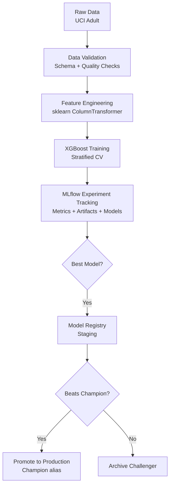
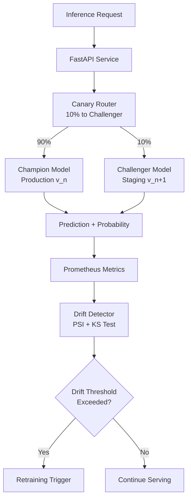

# MLForge


An end-to-end ML platform demonstrating the full model lifecycle on the UCI Adult income dataset. The ML task (binary classification) is intentionally simple — the platform is the point.

Built to reflect what ML engineers actually spend their time on: data validation, reproducible training pipelines, experiment tracking, model registry workflows, safe canary deployments, drift monitoring, and automated retraining triggers. None of these are optional in production; this project treats them as first-class concerns.

---

## Architecture

### Training & Registry Pipeline



### Serving & Monitoring Pipeline



---

## Key Design Decisions

### MLflow over W&B

MLflow is self-hostable with no API key requirement. The integrated model registry, versioning, and aliasing system (`champion`, `challenger`) means the experiment tracker is also the deployment control plane. There is no context switch between tools. For a team running ML in a private cloud or on-premise, MLflow is operationally simpler than a SaaS tracker.

### PSI for drift detection

PSI (Population Stability Index) gives a magnitude for drift, not just a p-value. The interpretation is stable and operationally intuitive: PSI < 0.1 is fine, 0.1–0.2 warrants investigation, > 0.2 triggers retraining. A KS test alone would tell you whether distributions differ (statistically significant) but not by how much — that makes it hard to set a retraining threshold. PSI and KS are used together: PSI sets the retraining threshold, KS provides a per-feature significance test.

### Canary deployment via deterministic hash routing

A gradual rollout limits the blast radius if a new model behaves unexpectedly in production. Routing is determined by `hash(request_id) % 100`, which means the same request always hits the same model version. This makes canary experiments reproducible: you can replay a batch of requests and get the same routing every time, which simplifies debugging and A/B analysis. Traffic routing is a pure function — no shared state required.

### Separate champion/challenger aliases

Decoupling model training from deployment via registry aliases means the serving layer never needs to know version numbers. The API loads `champion` at startup; a promotion pipeline updates which version the alias points to, and there is no deployment required to roll out a new model. Rollback is a single alias reassignment.

---

## ML Engineering Features

| Capability | Implementation |
|---|---|
| Data validation | Custom schema checks: required columns, null fractions, value ranges, categorical allowed values |
| Training-serving skew detection | KS test (numerical) + chi-squared (categorical) per feature |
| Feature engineering | sklearn `ColumnTransformer` with imputation + scaling + ordinal encoding |
| Experiment tracking | MLflow: params, metrics, feature importances, confusion matrix, model artifact |
| Cross-validation | Stratified K-fold with mean ± std logged per metric |
| Model registry | MLflow registry: None → Staging → Production → Archived lifecycle |
| Champion/challenger aliases | `champion` and `challenger` aliases; promotion archives previous production |
| Canary deployment | Deterministic hash routing; configurable split; hot-swap challenger |
| Online serving | FastAPI with batch endpoint, version-aware responses, Prometheus middleware |
| Feature drift detection | PSI + KS (numerical), PSI + chi-squared (categorical) per feature |
| Prediction drift detection | KS test + PSI on prediction probability distributions |
| Auto-retraining trigger | Threshold-based: triggers new training run and registers to Staging |
| Champion vs challenger evaluation | AUC-ROC comparison with configurable promotion delta (default: +0.005) |
| Prometheus metrics | Request count, latency histograms, prediction count, drift scores, models loaded |
| Grafana dashboards | Pre-provisioned: latency p50/p95/p99, prediction rate by version, drift scores |
| Containerised infrastructure | Docker Compose: Postgres, MLflow, Redis, API, Prometheus, Grafana |

---

## Quickstart

```bash
make install
make train
make serve
```

The training step fetches the UCI Adult dataset from OpenML, validates the schema, trains an XGBoost model with MLflow tracking, and saves the data splits. The serve step launches the FastAPI application on port 8000.

To run the full stack with Docker:

```bash
make docker-up
make train-register   # train + register to MLflow registry
```

---

## Project Layout

```
mlforge/
├── src/
│   ├── config.py                    # Pydantic Settings — all configuration
│   ├── data/
│   │   ├── loader.py                # DataLoader: fetch, clean, split, persist
│   │   └── validation.py            # DataValidator, SchemaDefinition, skew detection
│   ├── features/
│   │   └── pipeline.py              # ColumnTransformer preprocessing pipeline
│   ├── training/
│   │   ├── trainer.py               # Trainer: MLflow-tracked training + CV
│   │   └── experiment.py            # ExperimentManager: query and compare runs
│   ├── registry/
│   │   └── model_registry.py        # ModelRegistry: register, promote, compare
│   ├── serving/
│   │   ├── app.py                   # FastAPI application
│   │   ├── canary.py                # CanaryRouter: deterministic hash routing
│   │   └── middleware.py            # Prometheus metrics instrumentation
│   ├── monitoring/
│   │   ├── drift.py                 # DriftDetector: PSI, KS, chi-squared
│   │   └── retraining.py            # RetrainingTrigger: check + trigger pipeline
│   └── pipelines/
│       ├── train_pipeline.py        # CLI: end-to-end training
│       └── retrain_pipeline.py      # CLI: drift-triggered retraining
├── tests/
│   ├── test_validation.py
│   ├── test_features.py
│   ├── test_drift.py
│   └── test_api.py
├── monitoring/
│   ├── prometheus.yml
│   └── grafana/
│       ├── dashboard.json
│       └── provisioning/
├── docker-compose.yml
├── Dockerfile
├── Makefile
└── requirements.txt
```

---

## API Reference

All endpoints are documented interactively at `http://localhost:8000/docs`.

### POST /predict

```json
{
  "features": {
    "age": 39,
    "workclass": "State-gov",
    "fnlwgt": 77516,
    "education": "Bachelors",
    "education_num": 13,
    "marital_status": "Never-married",
    "occupation": "Adm-clerical",
    "relationship": "Not-in-family",
    "race": "White",
    "sex": "Male",
    "capital_gain": 2174,
    "capital_loss": 0,
    "hours_per_week": 40,
    "native_country": "United-States"
  },
  "request_id": "550e8400-e29b-41d4-a716-446655440000"
}
```

Response:

```json
{
  "prediction": 0,
  "probability": 0.183,
  "model_version": "3",
  "routed_to": "champion",
  "request_id": "550e8400-e29b-41d4-a716-446655440000"
}
```

### POST /predict/batch

Accepts `{ "instances": [...], "request_ids": [...] }`. The `request_ids` list is optional; stable UUIDs will be generated if omitted.

### GET /health

Returns `{ "status": "ok", "uptime_seconds": ..., "champion_version": ..., "canary_enabled": ..., "canary_split": ... }`.

### GET /model/info

Returns current champion/challenger versions, canary split configuration, and MLflow tracking URI.

### POST /model/promote

```json
{ "version": "4" }
```

Promotes version 4 from Staging to Production, archiving the previous champion.

### GET /drift/report

Returns the most recent drift detection report, including per-feature PSI scores and the triggered flag.

### GET /metrics

Prometheus scrape endpoint. Metrics exposed:

| Metric | Type | Description |
|---|---|---|
| `mlforge_http_requests_total` | Counter | Request count by method, endpoint, status code |
| `mlforge_http_request_duration_seconds` | Histogram | Latency by method and endpoint |
| `mlforge_predictions_total` | Counter | Prediction count by model version, route, prediction |
| `mlforge_prediction_probability` | Histogram | Prediction probability distribution |
| `mlforge_models_loaded` | Gauge | Number of models currently in memory |
| `mlforge_drift_score` | Gauge | PSI score per feature |
| `mlforge_canary_traffic_split` | Gauge | Current canary traffic fraction |

---

## Drift Detection

The `DriftDetector` runs two complementary tests per feature:

**Numerical features:**
- PSI over 10 equal-frequency bins derived from the reference distribution
- Two-sample KS test for distributional equality

**Categorical features:**
- PSI over ordinal-encoded category distribution
- Chi-squared test on contingency table

**Thresholds (configurable via `.env`):**

| PSI Range | Meaning | Action |
|---|---|---|
| < 0.1 | No significant drift | Continue |
| 0.1 – 0.2 | Moderate drift | Investigate |
| > 0.2 | Significant drift | Trigger retraining |

A retraining trigger fires if either:
1. The mean PSI across all features exceeds `PSI_THRESHOLD` (default 0.2), or
2. Any individual feature's KS/chi-squared p-value is below `KS_PVALUE_THRESHOLD` (default 0.05).

---

## Model Lifecycle

```
Training Run
    │
    ▼
MLflow Run (metrics + artifacts logged)
    │
    ▼
Model Registry (None stage)
    │
    ▼  promote_to_staging()
Staging (challenger alias assigned)
    │
    ▼  compare_champion_challenger() → recommendation: promote
Production (champion alias assigned, previous champion → Archived)
```

Version transitions are tracked in MLflow and fully auditable. The serving layer references aliases, not version numbers, so zero-downtime promotion is a single API call.

---

## Configuration

Copy `.env.example` to `.env` and adjust values as needed:

| Variable | Default | Description |
|---|---|---|
| `MLFLOW_TRACKING_URI` | `http://localhost:5000` | MLflow server URL |
| `MLFLOW_EXPERIMENT_NAME` | `adult-income` | Experiment name |
| `MODEL_NAME` | `adult-income-classifier` | Registered model name |
| `CANARY_TRAFFIC_SPLIT` | `0.1` | Fraction of traffic to challenger |
| `PSI_THRESHOLD` | `0.2` | Drift threshold for retraining |
| `KS_PVALUE_THRESHOLD` | `0.05` | KS/chi-squared significance threshold |
| `REDIS_URL` | `redis://localhost:6379` | Redis connection URL |
| `API_PORT` | `8000` | FastAPI server port |
| `TEST_SIZE` | `0.2` | Test set fraction |
| `VAL_SIZE` | `0.1` | Validation set fraction |

---

## Running Tests

```bash
make test
```

Test coverage spans data validation, feature engineering, drift detection, and API behaviour. MLflow is mocked in API tests — no external services required to run the test suite.

---

## License

MIT
